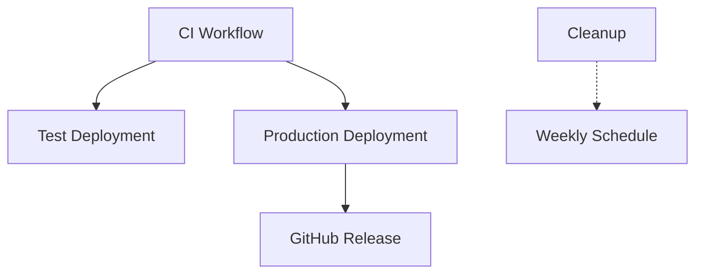

# 🚀 GitHub Actions Workflows

This directory contains the CI/CD workflows for the Anela Heblo application, following the infrastructure guidelines defined in `/docs/application_infrastructure.md`.

## 📋 Workflows Overview

### 🔄 CI Pipeline (`ci.yml`)
**Triggers:** All branches, all pull requests
**Purpose:** Continuous Integration - validate code quality and functionality

**Jobs:**
- `frontend-lint` - ESLint checks for React code
- `frontend-test` - Jest tests with coverage
- `frontend-build` - Production build verification
- `backend-lint` - .NET code formatting checks
- `backend-test` - Unit tests with coverage
- `backend-build` - .NET solution build
- `playwright-tests` - E2E tests with both servers running
- `docker-build` - Docker image build verification
- `quality-gate` - Ensures all jobs pass before allowing merge

### 🧪 Test Deployment (`deploy-test.yml`)
**Triggers:** Manual dispatch (workflow_dispatch)
**Purpose:** Deploy feature branches to test environment

**Features:**
- Branch selection input
- CI status verification (can be bypassed with `force_deploy`)
- Docker image build with test configuration
- Azure Web App deployment to `anela-heblo-test.azurewebsites.net`
- Health checks and deployment verification
- Mock authentication enabled

### 🚀 Production Deployment (`deploy-production.yml`)
**Triggers:** 
- Push to `main` branch (auto-deploy)
- Git tags `v*` 
- Manual dispatch (emergency deployment)

**Features:**
- Automatic semantic versioning
- CI verification (can be bypassed for emergencies)
- Docker image build with production configuration
- Azure Web App deployment to `anela-heblo.azurewebsites.net`
- Smoke tests after deployment
- GitHub release creation with changelog
- Real Microsoft Entra ID authentication

### 🧹 Cleanup (`cleanup.yml`)
**Triggers:** 
- Weekly schedule (Sundays at 2 AM UTC)
- Manual dispatch

**Purpose:** Clean up old artifacts and Docker images to save storage space

## 🔐 Required Secrets

Configure these secrets in GitHub repository settings:

### Docker Hub
- `DOCKER_USERNAME` - Docker Hub username
- `DOCKER_PASSWORD` - Docker Hub password or access token

### Azure Credentials
- `AZURE_CREDENTIALS_TEST` - Service principal for test environment
- `AZURE_CREDENTIALS_PROD` - Service principal for production environment

### Example Azure Credentials format:
```json
{
  "clientId": "xxx",
  "clientSecret": "xxx", 
  "subscriptionId": "xxx",
  "tenantId": "xxx"
}
```

## 🌍 Environment Configuration

### Test Environment
- **URL:** `https://anela-heblo-test.azurewebsites.net`
- **Resource Group:** `rg-anela-heblo-test`
- **Web App:** `anela-heblo-test`
- **Authentication:** Mock authentication enabled
- **Docker Tag:** `test-latest`, `test-{branch}-{sha}`

### Production Environment
- **URL:** `https://anela-heblo.azurewebsites.net`
- **Resource Group:** `rg-anela-heblo-prod`
- **Web App:** `anela-heblo`
- **Authentication:** Microsoft Entra ID
- **Docker Tag:** `latest`, `v{version}`, `{branch}-{sha}`

## 🏗️ Build Architecture

All environments use the same multi-stage Docker build:

1. **Frontend Stage:** Node.js 18 builds React app with `npm run build`
2. **Backend Stage:** .NET 8 SDK builds ASP.NET Core application
3. **Runtime Stage:** ASP.NET Core serves React static files + API endpoints

### Build Arguments by Environment:
- **Test:** `REACT_APP_USE_MOCK_AUTH=true`
- **Production:** `REACT_APP_USE_MOCK_AUTH=false`

## 🎯 Workflow Dependencies



## 🚨 Emergency Procedures

### Emergency Production Deployment
```bash
# Via GitHub UI: Actions > Deploy to Production > Run workflow
# Select "Skip tests" if needed for critical fixes
```

### Manual Test Environment Deployment
```bash
# Via GitHub UI: Actions > Deploy to Test Environment > Run workflow
# Select branch and optionally force deployment
```

### Rollback Procedure
1. Find the previous working Docker image tag in Docker Hub
2. Manually deploy via Azure Portal or Azure CLI:
   ```bash
   az webapp config container set \
     --name anela-heblo \
     --resource-group rg-anela-heblo-prod \
     --docker-custom-image-name your-username/anela-heblo:v1.2.3
   ```

## 📊 Monitoring and Alerts

- **Health Checks:** `/health` endpoint monitored during deployment
- **Smoke Tests:** Automated testing of critical paths post-deployment
- **Coverage Reports:** Uploaded to Codecov for both frontend and backend
- **Artifact Retention:** 7 days for CI artifacts, 30 days automatic cleanup

## 🔧 Maintenance

### Weekly Tasks (Automated)
- Artifact cleanup (>30 days old)
- Docker image cleanup suggestions

### Manual Tasks
- Review and update dependency versions
- Monitor Azure resource utilization
- Check Docker Hub storage usage
- Review failed workflow runs and investigate patterns