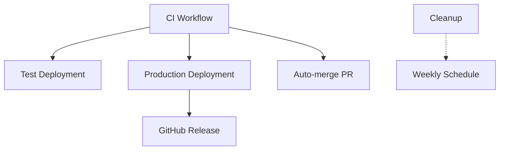

# 🚀 CI/CD Pipeline Documentation

This document consolidates all CI/CD and GitHub Actions workflow information for the Anela Heblo project.

---

## 📋 Overview

The project uses GitHub Actions for continuous integration and deployment with the following key principles:

- **CI runs on all branches and pull requests** - build, unit tests, UI tests (Playwright), Docker image build
- **Automatic deployment to production** from `main` branch when CI passes
- **Manual deployment to test environment** for feature branches
- **Auto-merge functionality** for PRs with `auto-merge` label
- **Docker Hub** as container registry
- **Azure Web App for Containers** for hosting

---

## 🔄 CI/CD Workflows

### 1. Continuous Integration (`ci.yml`)

**Triggers:**
- All pull requests to `main` branch
- Events: `opened`, `synchronize`, `reopened`, `ready_for_review`

**Jobs:**
1. **Frontend CI**
   - ~~ESLint checks~~ (removed for optimization)
   - Jest tests with coverage
   - Production build verification
   
2. **Backend CI**
   - ~~.NET code formatting~~ (removed for optimization)
   - Unit tests with coverage
   - .NET solution build

3. **UI Tests (Playwright)**
   - Runs after frontend and backend CI
   - Uses automation environment (ports 3001/5001)
   - Mock authentication enabled
   - Are allowed to fail so far (to be improved in future)

4. **Docker Build**
   - Validates Docker image can be built
   - Uses GitHub Actions cache for optimization

5. **Quality Gate**
   - Ensures all jobs pass before allowing merge
   - Generates CI summary report

6. **Auto-merge** 🆕
   - Automatically merges PR when all checks pass
   - Requires `auto-merge` label
   - Squash merges and deletes branch

### 2. Test Environment Deployment (`deploy-test.yml`)

**Triggers:**
- Manual dispatch (`workflow_dispatch`)

**Features:**
- Branch selection via input
- Optional CI bypass with `force_deploy` flag
- Deploys to `https://anela-heblo-test.azurewebsites.net`
- Mock authentication enabled
- Health check validation after deployment

**Docker Tags:**
- `test-latest`
- `test-{branch}-{sha}`

### 3. Production Deployment (`deploy-production.yml`)

**Triggers:**
- Push to `main` branch (automatic)
- Git tags matching `v*` pattern
- Manual dispatch (emergency deployment)

**Features:**
- Automatic semantic versioning
- CI verification (can be bypassed for emergencies)
- Deploys to `https://anela-heblo.azurewebsites.net`
- Real Microsoft Entra ID authentication
- Creates GitHub release with changelog
- Smoke tests after deployment

**Docker Tags:**
- `latest`
- `v{version}` (e.g., `v1.2.3`)
- `{branch}-{sha}`

### 4. Cleanup Workflow (`cleanup.yml`)

**Triggers:**
- Weekly schedule (Sundays at 2 AM UTC)
- Manual dispatch

**Purpose:**
- Clean up GitHub Actions artifacts older than 30 days
- Suggest Docker image cleanup
- Free up storage space

---

## 🏗️ Build Architecture

### Multi-stage Docker Build

```dockerfile
# Stage 1: Frontend Build
FROM node:18 AS frontend-build
# Builds React app with npm run build
# Output: /app/build/

# Stage 2: Backend Build  
FROM mcr.microsoft.com/dotnet/sdk:8.0 AS backend-build
# Builds .NET 8 application
# Output: /app/publish/

# Stage 3: Runtime
FROM mcr.microsoft.com/dotnet/aspnet:8.0 AS runtime
# Copies React build to wwwroot/
# Copies .NET app
# Configures to serve static files + API
# Exposes port 80
```

### Environment-specific Build Arguments

- **Test Environment:** `REACT_APP_USE_MOCK_AUTH=true`
- **Production Environment:** `REACT_APP_USE_MOCK_AUTH=false`

### Development vs Production Architecture

```
Development:                    Test/Production:
┌─────────────┐                ┌─────────────────────┐
│React Dev    │                │Single Container     │
│Server :3000 │ CORS           │┌─────────┬─────────┐│
│(Hot Reload) │◄──────────────►││React    │ASP.NET  ││
└─────────────┘                ││Static   │Core API ││
                               ││Files    │:80      ││
┌─────────────┐                │└─────────┴─────────┘│
│ASP.NET Core │                │Azure Web App        │
│API :5000    │                └─────────────────────┘
└─────────────┘
```

---

## 🤖 Auto-merge Functionality

### Enabling Auto-merge

1. **Repository Settings Required:**
   - Enable auto-merge in GitHub: Settings → General → Pull Requests → Allow auto-merge

2. **Branch Protection Rules for `main`:**
   - Require status checks to pass before merging
   - Require branches to be up to date before merging
   - Required status checks:
     - `frontend-ci`
     - `backend-ci`
     - `playwright-tests`
     - `docker-build`
     - `quality-gate`

3. **On Pull Request:**
   - Add `auto-merge` label
   - Ensure PR is not in draft mode
   - Wait for all CI checks to pass
   - Auto-merge activates automatically

### Manual Auto-merge

```bash
gh pr merge --auto --squash --delete-branch
```

---

## 🔐 GitHub Secrets Configuration

### Docker Hub Authentication
- **`DOCKER_USERNAME`**: Docker Hub username
- **`DOCKER_PASSWORD`**: Docker Hub access token (not password!)
  - Create at: Docker Hub → Account Settings → Security → New Access Token

### Azure Service Principal Credentials

```bash
# Test environment
az ad sp create-for-rbac \
  --name "github-actions-anela-heblo-test" \
  --role contributor \
  --scopes /subscriptions/{subscription-id}/resourceGroups/rg-anela-heblo-test \
  --sdk-auth

# Production environment  
az ad sp create-for-rbac \
  --name "github-actions-anela-heblo-prod" \
  --role contributor \
  --scopes /subscriptions/{subscription-id}/resourceGroups/rg-anela-heblo-prod \
  --sdk-auth
```

Store the JSON output as:
- **`AZURE_CREDENTIALS_TEST`**: Test environment service principal
- **`AZURE_CREDENTIALS_PROD`**: Production environment service principal

### Microsoft Entra ID (Production Only)
- **`AZURE_CLIENT_ID_PROD`**: Azure AD application client ID
- **`AZURE_AUTHORITY_PROD`**: Azure AD authority URL
  - Format: `https://login.microsoftonline.com/{tenant-id}`

### Automatically Provided
- **`GITHUB_TOKEN`**: Provided by GitHub Actions
  - Requires `contents: write` permission in workflow

---

## 🌿 Branching Strategy

- **Main branch**: Production-ready code
- **Feature branches**: `feature/*`
- **Bugfix branches**: `fix/*`
- **Merge requirements**:
  - Must pass CI pipeline
  - Uses squash merge in PRs
  - AI PR reviewer for solo developer

---

## 🔖 Versioning Strategy

### Semantic Versioning
- Format: `MAJOR.MINOR.PATCH`
- Automatic version bump based on conventional commits:
  - `feat:` → Minor version bump
  - `fix:` → Patch version bump
  - `BREAKING CHANGE:` → Major version bump

### Version Locations
- Docker image tags
- `AssemblyInfo.cs`
- `package.json`
- GitHub releases

### Container Tag Strategy
- **Production**: Specific version tags (e.g., `remiiik/heblo:v1.2.3`)
- **Development/Test**: May use `latest` for convenience
- **Fallback**: Deployment uses versioned tag if build output unavailable

---

## 🚨 Emergency Procedures

### Emergency Production Deployment
1. Go to GitHub Actions → Deploy to Production
2. Click "Run workflow"
3. Select "Skip tests" if needed for critical fixes

### Manual Test Deployment
1. Go to GitHub Actions → Deploy to Test Environment
2. Click "Run workflow"
3. Select branch and optionally force deployment

### Rollback Procedure
```bash
# Find previous working version
docker images remiiik/heblo --format "table {{.Tag}}\t{{.CreatedAt}}"

# Deploy specific version via Azure CLI
az webapp config container set \
  --name anela-heblo \
  --resource-group rg-anela-heblo-prod \
  --docker-custom-image-name remiiik/heblo:v1.2.3
```

---

## 📊 Monitoring and Maintenance

### Automated Monitoring
- **Health Checks**: `/health` endpoint validation during deployment
- **Coverage Reports**: Uploaded to Codecov for frontend and backend
- **Artifact Retention**: 7 days for CI artifacts
- **Weekly Cleanup**: Automated artifact and image cleanup

### Manual Maintenance Tasks
- Review dependency updates
- Monitor Azure resource utilization
- Check Docker Hub storage usage
- Analyze failed workflow patterns

---

## 🎯 Workflow Dependencies



---

## ⚠️ Important Notes

1. **CI Validation**: Deployment workflows no longer wait for CI to pass by default
2. **Manual Database Migrations**: EF Core migrations are not part of automated deployment
3. **AI Code Reviews**: PRs reviewed by AI agent for solo developer workflow
4. **Container Ports**: Internal port 80, Azure maps to 443 (HTTPS)
5. **Static Files**: Served by ASP.NET Core in production, React dev server in development