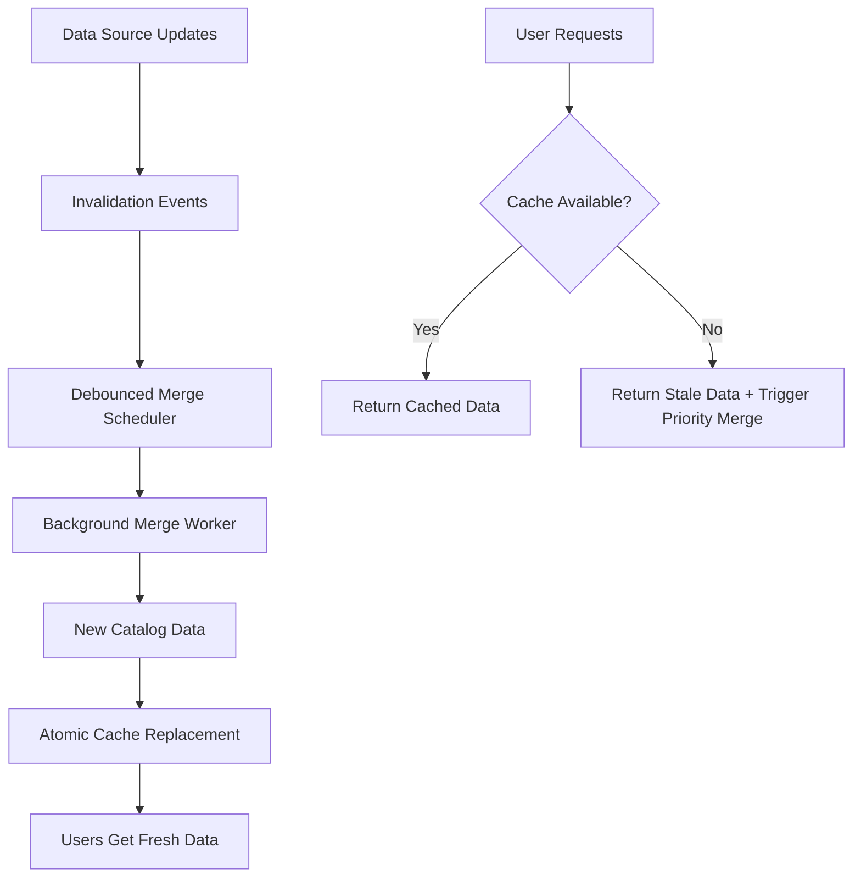

# Catalog Cache Optimization Strategy

## Problem Statement

CatalogRepository loads data from multiple sources with varying update frequencies and processing times. Currently:

- **Inefficient invalidation**: Cache is cleared immediately when any source data changes
- **On-demand merging**: Expensive `Merge()` operation runs only when `CatalogData` is requested
- **Multiple invalidations**: Multiple data source updates can trigger excessive merge operations
- **User-facing delays**: Users experience delays when requesting data after invalidation

## Proposed Solution: Background Merge with Debouncing

### Architecture Overview



### Core Components

#### 1. Merge Scheduler with Debouncing

```csharp
public class CatalogMergeScheduler
{
    private readonly Timer _debounceTimer;
    private readonly SemaphoreSlim _mergeSemaphore;
    private readonly TimeSpan _debounceDelay = TimeSpan.FromSeconds(5);
    private readonly TimeSpan _maxMergeInterval = TimeSpan.FromMinutes(30);
    
    private DateTime _lastInvalidation;
    private DateTime _lastMergeCompleted;
    private bool _mergeScheduled;

    public void ScheduleMerge(string dataSource)
    {
        lock (_lock)
        {
            _lastInvalidation = DateTime.UtcNow;
            
            // Reset debounce timer
            _debounceTimer?.Dispose();
            _debounceTimer = new Timer(ExecuteMerge, null, _debounceDelay, Timeout.InfiniteTimeSpan);
            
            _mergeScheduled = true;
        }
    }

    private async void ExecuteMerge(object state)
    {
        if (!await _mergeSemaphore.WaitAsync(100)) // Don't block if merge already running
            return;

        try
        {
            await _catalogRepository.ExecuteBackgroundMerge();
            _lastMergeCompleted = DateTime.UtcNow;
            _mergeScheduled = false;
        }
        finally
        {
            _mergeSemaphore.Release();
        }
    }
}
```

#### 2. Enhanced CatalogRepository

```csharp
public class CatalogRepository : ICatalogRepository
{
    private CatalogData _currentCache;
    private CatalogData _staleCache; // Fallback during merge
    private readonly CatalogMergeScheduler _mergeScheduler;
    private readonly SemaphoreSlim _cacheReplacementSemaphore = new(1, 1);
    
    // Individual data source caches
    private readonly ConcurrentDictionary<string, object> _sourceDataCache = new();
    private readonly ConcurrentDictionary<string, DateTime> _sourceLastUpdated = new();

    public async Task<CatalogData> GetCatalogDataAsync()
    {
        // Return current cache if available and recent
        if (_currentCache != null && IsCacheValid())
        {
            return _currentCache;
        }

        // If merge is in progress, return stale data (better than waiting)
        if (_mergeScheduler.IsMergeInProgress && _staleCache != null)
        {
            // Optionally log that stale data is being returned
            return _staleCache;
        }

        // No cache available - trigger priority merge and wait
        return await ExecutePriorityMerge();
    }

    public async Task InvalidateSourceData(string dataSource, object newData)
    {
        // Update source data immediately
        _sourceDataCache[dataSource] = newData;
        _sourceLastUpdated[dataSource] = DateTime.UtcNow;

        // Schedule background merge (debounced)
        _mergeScheduler.ScheduleMerge(dataSource);
    }

    public async Task ExecuteBackgroundMerge()
    {
        try
        {
            // Create new merged data from all sources
            var newCatalogData = await MergeAllSources();

            // Atomic replacement of cache
            await ReplaceCacheAtomically(newCatalogData);
        }
        catch (Exception ex)
        {
            // Log error but don't crash - keep existing cache
            _logger.LogError(ex, "Background merge failed");
        }
    }

    private async Task ReplaceCacheAtomically(CatalogData newData)
    {
        await _cacheReplacementSemaphore.WaitAsync();
        try
        {
            _staleCache = _currentCache; // Keep as fallback
            _currentCache = newData;     // Replace with fresh data
            
            // Clean up old stale cache after delay
            _ = Task.Delay(TimeSpan.FromMinutes(5))
                   .ContinueWith(_ => _staleCache = null);
        }
        finally
        {
            _cacheReplacementSemaphore.Release();
        }
    }

    private async Task<CatalogData> MergeAllSources()
    {
        // Your existing merge logic using data from _sourceDataCache
        var shoptetData = _sourceDataCache.GetValueOrDefault("shoptet");
        var abraData = _sourceDataCache.GetValueOrDefault("abra");
        var manufacturingData = _sourceDataCache.GetValueOrDefault("manufacturing");
        
        // Perform complex merge operation
        return await PerformComplexMerge(shoptetData, abraData, manufacturingData);
    }
}
```

#### 3. Configuration Options

```csharp
public class CatalogCacheOptions
{
    /// <summary>
    /// Delay before executing merge after last invalidation
    /// </summary>
    public TimeSpan DebounceDelay { get; set; } = TimeSpan.FromSeconds(5);

    /// <summary>
    /// Maximum time to wait before forcing a merge (even if invalidations keep coming)
    /// </summary>
    public TimeSpan MaxMergeInterval { get; set; } = TimeSpan.FromMinutes(30);

    /// <summary>
    /// How long cached data is considered valid without any updates
    /// </summary>
    public TimeSpan CacheValidityPeriod { get; set; } = TimeSpan.FromHours(4);

    /// <summary>
    /// Whether to return stale data during merge operations
    /// </summary>
    public bool AllowStaleDataDuringMerge { get; set; } = true;

    /// <summary>
    /// How long to keep stale cache as fallback
    /// </summary>
    public TimeSpan StaleDataRetentionPeriod { get; set; } = TimeSpan.FromMinutes(5);
}
```

### Integration with Dependency Injection

```csharp
// Program.cs or ServiceCollectionExtensions.cs
services.Configure<CatalogCacheOptions>(configuration.GetSection("CatalogCache"));
services.AddSingleton<CatalogMergeScheduler>();
services.AddScoped<ICatalogRepository, CatalogRepository>();

// Background service for periodic health checks
services.AddHostedService<CatalogCacheHealthService>();
```

### Benefits of This Solution

#### ✅ Performance Improvements
- **No user-facing delays**: Users get immediate responses (current or stale data)
- **Debounced merging**: Multiple invalidations within 5 seconds result in single merge
- **Background processing**: Expensive operations don't block user requests
- **Atomic updates**: Cache replacement is thread-safe and instantaneous

#### ✅ Reliability Improvements
- **Graceful degradation**: Stale data available during merge failures
- **Fallback mechanism**: Multiple cache levels provide redundancy
- **Error isolation**: Merge failures don't break existing functionality
- **Health monitoring**: Background service can detect and alert on merge issues

#### ✅ Resource Optimization
- **Reduced CPU usage**: Fewer unnecessary merge operations
- **Memory efficiency**: Controlled cache lifecycle with cleanup
- **Network efficiency**: Data sources aren't overwhelmed by frequent requests

### Implementation Strategy

#### Phase 1: Core Infrastructure
1. Implement `CatalogMergeScheduler` with basic debouncing
2. Modify `CatalogRepository` to support dual cache (current/stale)
3. Add configuration options and DI setup

#### Phase 2: Background Processing  
1. Implement background merge execution
2. Add atomic cache replacement logic
3. Implement stale data fallback mechanism

#### Phase 3: Monitoring & Health Checks
1. Add logging and metrics for merge operations
2. Implement health check service
3. Add alerting for merge failures or excessive delays

#### Phase 4: Testing & Optimization
1. Load testing with multiple concurrent invalidations
2. Performance profiling of merge operations  
3. Fine-tune debounce and cache retention timings

### Configuration Example

```json
{
  "CatalogCache": {
    "DebounceDelay": "00:00:05",
    "MaxMergeInterval": "00:30:00", 
    "CacheValidityPeriod": "04:00:00",
    "AllowStaleDataDuringMerge": true,
    "StaleDataRetentionPeriod": "00:05:00"
  }
}
```

### Monitoring & Observability

#### Key Metrics to Track
- **Merge frequency**: How often merges are triggered
- **Merge duration**: Time taken for each merge operation
- **Cache hit ratio**: Percentage of requests served from cache vs stale/priority merge
- **Debounce effectiveness**: How many invalidations are collapsed into single merges
- **Error rates**: Frequency of merge failures

#### Logging Strategy
```csharp
_logger.LogInformation("Merge scheduled for source {DataSource}, debounce delay {Delay}ms", 
    dataSource, _debounceDelay.TotalMilliseconds);

_logger.LogInformation("Background merge completed in {Duration}ms, cache updated", 
    stopwatch.ElapsedMilliseconds);

_logger.LogWarning("Serving stale data during merge operation for {Duration}ms", 
    mergeInProgressDuration.TotalMilliseconds);
```

This solution provides efficient, user-friendly catalog data management while optimizing resource usage and maintaining system reliability.