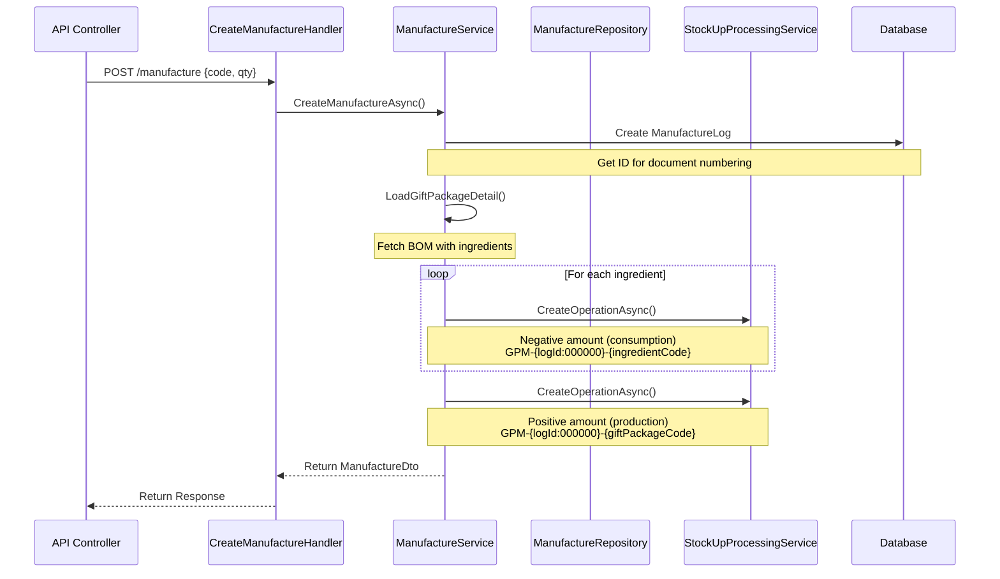

# Gift Package Manufacture Feature

## Overview

The Gift Package Manufacture feature enables production of gift package sets (ProductType.Set) from individual ingredients with automatic stock management, demand forecasting, and audit trails. It integrates deeply with Catalog, Manufacture (BOM), and Stock-Up modules to provide a complete manufacturing workflow.

## Business Context

Gift packages are composite products (sets) sold as single units but manufactured from multiple individual ingredients. The system:
- Tracks daily sales to forecast demand
- Calculates optimal stock levels based on sales velocity
- Provides severity indicators (Critical/Severe/Optimal) for prioritization
- Automates stock operations: consumes ingredients, produces output packages
- Maintains complete audit trails for regulatory compliance

## Architecture

### Clean Architecture Layers

```
API Layer (Controllers)
    ↓
Application Layer (Handlers → Services)
    ↓
Domain Layer (Entities, Repository Interfaces)
    ↓
Infrastructure Layer (Repository Implementations, EF Core)
```

### Module Organization

```
Backend:
/Domain/Features/Logistics/GiftPackageManufacture/
  - GiftPackageManufactureLog.cs (aggregate root)
  - GiftPackageManufactureItem.cs (child entity)
  - IGiftPackageManufactureRepository.cs

/Application/Features/Logistics/UseCases/GiftPackageManufacture/
  - Services/
    - IGiftPackageManufactureService.cs
    - GiftPackageManufactureService.cs
  - Contracts/ (DTOs)
  - UseCases/ (MediatR handlers)
  - GiftPackageManufactureMappingProfile.cs
  - GiftPackageManufactureModule.cs

/Persistence/Logistics/GiftPackageManufacture/
  - GiftPackageManufactureRepository.cs
  - GiftPackageManufactureLogConfiguration.cs
  - GiftPackageManufactureItemConfiguration.cs

/API/Controllers/
  - LogisticsController.cs (hosts endpoints)
```

## Domain Model

### GiftPackageManufactureLog (Aggregate Root)

**Purpose**: Records each manufacturing operation with metadata for audit and traceability.

**Properties**:
```csharp
int Id                      // Auto-generated primary key
string GiftPackageCode      // Product code of manufactured set (max 50 chars)
int QuantityCreated         // Number of units produced
bool StockOverrideApplied   // Whether stock validation was bypassed
DateTime CreatedAt          // UTC timestamp of manufacture
string CreatedBy            // User name who initiated the operation
List<GiftPackageManufactureItem> ConsumedItems  // Ingredients consumed
```

**Key Methods**:
- `AddConsumedItem(productCode, quantity)` - Records ingredient consumption

### GiftPackageManufactureItem (Child Entity)

**Purpose**: Tracks individual ingredient consumption per manufacture operation.

**Properties**:
```csharp
int Id                  // Primary key
int ManufactureLogId    // Foreign key (cascade delete)
string ProductCode      // Ingredient product code (max 50 chars)
int QuantityConsumed    // Amount of ingredient consumed
```

### Repository Interface

```csharp
public interface IGiftPackageManufactureRepository
{
    Task<GiftPackageManufactureLog> GetByIdAsync(int id);
    Task<List<GiftPackageManufactureLog>> GetRecentManufactureLogsAsync(int count = 10);
    Task AddAsync(GiftPackageManufactureLog log);
    Task SaveChangesAsync(CancellationToken cancellationToken = default);
}
```

## Database Schema

### Tables

**gift_package_manufacture_logs**
```sql
CREATE TABLE gift_package_manufacture_logs (
    id integer PRIMARY KEY GENERATED BY DEFAULT AS IDENTITY,
    gift_package_code varchar(50) NOT NULL,
    quantity_created integer NOT NULL,
    stock_override_applied boolean NOT NULL,
    created_at timestamp without time zone NOT NULL,
    created_by text NOT NULL
);

-- Indexes
CREATE INDEX ix_gift_package_manufacture_logs_gift_package_code
    ON gift_package_manufacture_logs(gift_package_code);
CREATE INDEX ix_gift_package_manufacture_logs_created_at
    ON gift_package_manufacture_logs(created_at);
```

**gift_package_manufacture_items**
```sql
CREATE TABLE gift_package_manufacture_items (
    id integer PRIMARY KEY GENERATED BY DEFAULT AS IDENTITY,
    manufacture_log_id integer NOT NULL,
    product_code varchar(50) NOT NULL,
    quantity_consumed integer NOT NULL,
    CONSTRAINT fk_manufacture_log
        FOREIGN KEY (manufacture_log_id)
        REFERENCES gift_package_manufacture_logs(id)
        ON DELETE CASCADE
);

-- Indexes
CREATE INDEX ix_gift_package_manufacture_items_manufacture_log_id
    ON gift_package_manufacture_items(manufacture_log_id);
CREATE INDEX ix_gift_package_manufacture_items_product_code
    ON gift_package_manufacture_items(product_code);
```

### Migrations

1. **20250909115907_AddGiftPackageManufacturing**: Initial schema creation
2. **20250910103535_UpdateGiftPackageManufacturing**: Changed `created_by` from UUID to text string (supports both Entra ID and mock auth)

## Application Layer

### Service Interface

```csharp
public interface IGiftPackageManufactureService
{
    // List all available gift packages with stock analysis
    Task<List<GiftPackageDto>> GetAvailableGiftPackagesAsync(
        decimal salesCoefficient = 1.0m,
        DateTime? fromDate = null,
        DateTime? toDate = null,
        CancellationToken cancellationToken = default);

    // Get detailed info for a specific gift package (includes ingredients)
    Task<GiftPackageDto> GetGiftPackageDetailAsync(
        string giftPackageCode,
        decimal salesCoefficient = 1.0m,
        DateTime? fromDate = null,
        DateTime? toDate = null,
        CancellationToken cancellationToken = default);

    // Execute manufacturing operation
    Task<GiftPackageManufactureDto> CreateManufactureAsync(
        string giftPackageCode,
        int quantity,
        bool allowStockOverride,
        CancellationToken cancellationToken = default);
}
```

### Key DTOs

**GiftPackageDto**
```csharp
public class GiftPackageDto
{
    public string Code { get; set; }
    public string Name { get; set; }
    public int AvailableStock { get; set; }
    public decimal DailySales { get; set; }
    public int OverstockMinimal { get; set; }       // Minimum threshold
    public int OverstockOptimal { get; set; }        // Target stock days
    public int SuggestedQuantity { get; set; }       // Calculated production recommendation
    public StockSeverity Severity { get; set; }      // Critical | Severe | Optimal
    public decimal StockCoveragePercent { get; set; } // % of optimal stock
    public List<GiftPackageIngredientDto>? Ingredients { get; set; }
}
```

**GiftPackageIngredientDto**
```csharp
public class GiftPackageIngredientDto
{
    public required string ProductCode { get; set; }
    public string? ProductName { get; set; }
    public double RequiredQuantity { get; set; }    // Per unit of gift package
    public double AvailableStock { get; set; }
    public string? Image { get; set; }

    // Computed: AvailableStock >= RequiredQuantity
    public bool HasSufficientStock => AvailableStock >= RequiredQuantity;
}
```

**GiftPackageManufactureDto**
```csharp
public class GiftPackageManufactureDto
{
    public int Id { get; set; }
    public string GiftPackageCode { get; set; }
    public int QuantityCreated { get; set; }
    public bool StockOverrideApplied { get; set; }
    public DateTime CreatedAt { get; set; }
    public string CreatedBy { get; set; }
    public List<GiftPackageManufactureItemDto> ConsumedItems { get; set; }
}
```

### MediatR Use Cases

All use cases follow the pattern: Request → Handler → Service

1. **GetAvailableGiftPackages**
   - Request: `GetAvailableGiftPackagesRequest` (salesCoefficient, fromDate, toDate)
   - Response: `GetAvailableGiftPackagesResponse` (list of GiftPackageDto)
   - Handler: `GetAvailableGiftPackagesHandler`

2. **GetGiftPackageDetail**
   - Request: `GetGiftPackageDetailRequest` (giftPackageCode, salesCoefficient, dates)
   - Response: `GetGiftPackageDetailResponse` (single GiftPackageDto with ingredients)
   - Handler: `GetGiftPackageDetailHandler`

3. **CreateGiftPackageManufacture**
   - Request: `CreateGiftPackageManufactureRequest` (giftPackageCode, quantity, allowStockOverride)
   - Response: `CreateGiftPackageManufactureResponse` (GiftPackageManufactureDto)
   - Handler: `CreateGiftPackageManufactureHandler`

4. **EnqueueGiftPackageManufacture**
   - Request: `EnqueueGiftPackageManufactureRequest` (background job)
   - Response: `EnqueueGiftPackageManufactureResponse` (JobId)
   - Handler: `EnqueueGiftPackageManufactureHandler`

5. **GetManufactureLog**
   - Request: `GetManufactureLogRequest` (count = 10)
   - Response: `GetManufactureLogResponse` (list of recent logs)
   - Handler: `GetManufactureLogHandler`

## API Endpoints

**Base Route**: `/api/logistics`

**Authentication**: All endpoints require `[Authorize]`

### GET Endpoints

#### 1. List Available Gift Packages

```http
GET /api/logistics/gift-packages/available
    ?salesCoefficient=1.0
    &fromDate=2025-01-01
    &toDate=2025-12-31
```

**Response**: `GetAvailableGiftPackagesResponse`
```json
{
  "giftPackages": [
    {
      "code": "SET001",
      "name": "Relaxation Gift Set",
      "availableStock": 15,
      "dailySales": 2.5,
      "overstockMinimal": 20,
      "overstockOptimal": 30,
      "suggestedQuantity": 75,
      "severity": "Critical",
      "stockCoveragePercent": 20.0,
      "ingredients": null
    }
  ]
}
```

**Use Case**: Dashboard display, production planning overview

#### 2. Get Gift Package Detail

```http
GET /api/logistics/gift-packages/{giftPackageCode}/detail
    ?salesCoefficient=1.0
    &fromDate=2025-01-01
    &toDate=2025-12-31
```

**Response**: `GetGiftPackageDetailResponse`
```json
{
  "giftPackage": {
    "code": "SET001",
    "name": "Relaxation Gift Set",
    "availableStock": 15,
    "dailySales": 2.5,
    "suggestedQuantity": 75,
    "severity": "Critical",
    "ingredients": [
      {
        "productCode": "SOAP001",
        "productName": "Lavender Soap",
        "requiredQuantity": 1.0,
        "availableStock": 150.0,
        "hasSufficientStock": true,
        "image": "https://cdn.example.com/soap.jpg"
      },
      {
        "productCode": "CANDLE001",
        "productName": "Vanilla Candle",
        "requiredQuantity": 2.0,
        "availableStock": 50.0,
        "hasSufficientStock": true,
        "image": null
      }
    ]
  }
}
```

**Use Case**: Production form, ingredient availability check

#### 3. Get Recent Manufacture Logs

```http
GET /api/logistics/gift-packages/manufacture-log?count=10
```

**Response**: `GetManufactureLogResponse`
```json
{
  "logs": [
    {
      "id": 42,
      "giftPackageCode": "SET001",
      "quantityCreated": 50,
      "stockOverrideApplied": false,
      "createdAt": "2025-01-15T10:30:00Z",
      "createdBy": "John Doe",
      "consumedItems": [
        {
          "id": 101,
          "productCode": "SOAP001",
          "quantityConsumed": 50
        },
        {
          "id": 102,
          "productCode": "CANDLE001",
          "quantityConsumed": 100
        }
      ]
    }
  ]
}
```

**Use Case**: Audit trail, manufacturing history

### POST Endpoints

#### 4. Create Manufacture Operation

```http
POST /api/logistics/gift-packages/manufacture
Content-Type: application/json

{
  "giftPackageCode": "SET001",
  "quantity": 50,
  "allowStockOverride": false
}
```

**Response**: `CreateGiftPackageManufactureResponse`
```json
{
  "manufacture": {
    "id": 42,
    "giftPackageCode": "SET001",
    "quantityCreated": 50,
    "stockOverrideApplied": false,
    "createdAt": "2025-01-15T10:30:00Z",
    "createdBy": "John Doe",
    "consumedItems": [...]
  }
}
```

**Side Effects**:
- Creates `GiftPackageManufactureLog` record
- Creates stock-down operations for each ingredient (negative amounts)
- Creates stock-up operation for output product (positive amount)
- All operations linked via document number: `GPM-{logId:000000}-{productCode}`

**Use Case**: Execute production batch

#### 5. Enqueue Manufacture (Background Job)

```http
POST /api/logistics/gift-packages/manufacture/enqueue
Content-Type: application/json

{
  "giftPackageCode": "SET001",
  "quantity": 100,
  "allowStockOverride": false
}
```

**Response**: `EnqueueGiftPackageManufactureResponse`
```json
{
  "jobId": "hangfire-job-id-123",
  "message": "Gift package manufacture queued successfully"
}
```

**Use Case**: Batch processing, scheduled production runs

## Business Logic and Calculations

### Daily Sales Calculation

```csharp
// Date range: Use provided dates or fallback to last 12 months
actualToDate = toDate ?? DateTime.UtcNow;
actualFromDate = fromDate ?? actualToDate.AddYears(-1);
daysDiff = Math.Max((actualToDate - actualFromDate).Days, 1);

// Calculate daily sales with coefficient
totalSalesInPeriod = product.GetTotalSold(actualFromDate, actualToDate) * salesCoefficient;
dailySales = totalSalesInPeriod / daysDiff;
```

**Purpose**: Normalize sales velocity across different time periods for forecasting.

**salesCoefficient**: Adjustment factor for seasonality or expected growth (default 1.0).

### Suggested Quantity Calculation

```csharp
suggestedQuantity = (int)Math.Max(0, dailySales * product.Properties.OptimalStockDaysSetup);
```

**Formula**: DailySales × OptimalStockDays

**Example**:
- Daily sales: 2.5 units
- Optimal stock days: 30
- Suggested quantity: 75 units

**Purpose**: Recommends production quantity to reach optimal stock level.

### Severity Calculation

```csharp
if (availableStock < overstockMinimal)
    return StockSeverity.Critical;  // Red: Below minimum threshold

if (availableStock < suggestedQuantity)
    return StockSeverity.Severe;    // Orange: Below optimal level

return StockSeverity.Optimal;       // Green: Adequate stock
```

**Purpose**: Visual prioritization for production scheduling.

### Stock Coverage Percentage

```csharp
if (dailySales <= 0 || overstockOptimal <= 0)
    return 0m;  // Avoid division by zero

optimalStockAmount = dailySales * overstockOptimal;
stockCoveragePercent = (availableStock / optimalStockAmount) * 100m;
```

**Formula**: (AvailableStock / (DailySales × OptimalStockDays)) × 100

**Example**:
- Available: 15 units
- Daily sales: 2.5 units
- Optimal days: 30
- Coverage: (15 / 75) × 100 = 20%

**Purpose**: Quantifies how much of optimal stock is currently available.

## Manufacturing Process Flow

### Step-by-Step Execution



### Implementation Details

1. **Create Log Entry** (Line 186-195 in Service)
   ```csharp
   var manufactureLog = new GiftPackageManufactureLog(
       giftPackageCode,
       quantity,
       allowStockOverride,
       _timeProvider.GetUtcNow().DateTime,
       _currentUserService.GetCurrentUser().Name ?? "System");

   await _giftPackageRepository.AddAsync(manufactureLog);
   await _giftPackageRepository.SaveChangesAsync();  // CRITICAL: Get ID first
   ```

2. **Load Gift Package Detail** (Line 201)
   ```csharp
   var giftPackage = await GetGiftPackageDetailAsync(giftPackageCode, 1.0m, null, null);
   ```

3. **Process Each Ingredient** (Line 204-224)
   ```csharp
   foreach (var ingredient in giftPackage.Ingredients)
   {
       var consumedQuantity = (int)(ingredient.RequiredQuantity * quantity);
       manufactureLog.AddConsumedItem(ingredient.ProductCode, consumedQuantity);

       var documentNumber = $"GPM-{manufactureLog.Id:000000}-{ingredient.ProductCode}";

       await _stockUpProcessingService.CreateOperationAsync(
           documentNumber,
           ingredient.ProductCode,
           -consumedQuantity,  // Negative = consumption
           StockUpSourceType.GiftPackageManufacture,
           manufactureLog.Id);
   }
   ```

4. **Create Output Product** (Line 227-238)
   ```csharp
   var outputDocNumber = $"GPM-{manufactureLog.Id:000000}-{giftPackageCode}";

   await _stockUpProcessingService.CreateOperationAsync(
       outputDocNumber,
       giftPackageCode,
       quantity,  // Positive = production
       StockUpSourceType.GiftPackageManufacture,
       manufactureLog.Id);
   ```

### Document Number Format

**Pattern**: `GPM-{logId:000000}-{productCode}`

**Examples**:
- `GPM-000042-SOAP001` - Ingredient consumption
- `GPM-000042-CANDLE001` - Ingredient consumption
- `GPM-000042-SET001` - Output product

**Purpose**:
- Links all stock operations to the manufacture log
- Enables audit trail reconstruction
- Supports regulatory compliance

## Integration Points

### 1. Catalog Module

**Purpose**: Source of truth for product data and stock levels

**Integration**:
```csharp
// Get Set-type products
var catalogData = await _catalogRepository.GetAllAsync();
var setProducts = catalogData.Where(x => x.Type == ProductType.Set);

// Get ingredient stock levels
var ingredientProduct = await _catalogRepository.GetByIdAsync(part.ProductCode);
var availableStock = ingredientProduct?.Stock.Available ?? 0;
```

**Data Used**:
- `ProductType.Set` - Identifies gift packages
- `Stock.Available` - Current inventory
- `Properties.StockMinSetup` - Minimum threshold
- `Properties.OptimalStockDaysSetup` - Target coverage days
- Sales history via `GetTotalSold(fromDate, toDate)`

### 2. Manufacture Module

**Purpose**: Provides Bill of Materials (BOM) for gift packages

**Integration**:
```csharp
var productParts = await _manufactureRepository.GetSetPartsAsync(giftPackageCode);
```

**Returns**: `List<ProductPart>`
```csharp
public class ProductPart
{
    public string ProductCode { get; set; }
    public string ProductName { get; set; }
    public double Amount { get; set; }  // Required quantity per unit
}
```

**Example BOM**:
- SET001 (Gift Package)
  - SOAP001 (Lavender Soap) × 1
  - CANDLE001 (Vanilla Candle) × 2
  - RIBBON001 (Decorative Ribbon) × 0.5

### 3. Stock Module (Stock-Up Processing)

**Purpose**: Automated inventory adjustment for manufacturing operations

**Integration**:
```csharp
await _stockUpProcessingService.CreateOperationAsync(
    documentNumber: "GPM-000042-SOAP001",
    productCode: "SOAP001",
    amount: -50,  // Negative = consumption
    sourceType: StockUpSourceType.GiftPackageManufacture,
    sourceId: 42,  // manufactureLog.Id
    cancellationToken);
```

**Stock Operation Types**:
- **Ingredient Consumption**: Negative amounts (stock-down)
- **Output Production**: Positive amounts (stock-up)

**Source Type Enum**:
```csharp
public enum StockUpSourceType
{
    GiftPackageManufacture = 1,
    // ... other sources
}
```

**Asynchronous Processing**:
- Operations created immediately
- Background jobs process operations (update ABRA Flexi, Shoptet)
- Supports transactional consistency

### 4. Users Module (Current User Context)

**Purpose**: Audit trail - capture who initiated the operation

**Integration**:
```csharp
var currentUser = _currentUserService.GetCurrentUser();
var createdBy = currentUser.Name ?? "System";
```

**Supports**:
- Microsoft Entra ID authentication (production)
- Mock authentication (development/testing)

### 5. Dashboard Integration

**CriticalGiftPackagesTile**:
```csharp
// Custom dashboard tile
var giftPackages = await _giftPackageManufactureService.GetAvailableGiftPackagesAsync();
var criticalCount = giftPackages.Count(x => x.Severity == StockSeverity.Critical);
```

**Purpose**: Real-time monitoring of critical stock levels on warehouse dashboard.

## Hangfire Background Jobs

### Job Configuration

**Service Method Decoration**:
```csharp
[DisplayName("GiftPackageManufacture-{0}-{1}")]
public async Task<GiftPackageManufactureDto> CreateManufactureAsync(...)
```

**Purpose**: Makes the method available for background execution via Hangfire.

**Job Name Format**: `GiftPackageManufacture-{giftPackageCode}-{quantity}`

**Example**: `GiftPackageManufacture-SET001-50`

### Enqueue Pattern

```csharp
var jobId = BackgroundJob.Enqueue<IGiftPackageManufactureService>(
    service => service.CreateManufactureAsync(
        giftPackageCode,
        quantity,
        allowStockOverride,
        CancellationToken.None));
```

**Use Cases**:
- Large batch production runs
- Scheduled overnight manufacturing
- Asynchronous processing to avoid blocking UI

## Testing Strategy

### Unit Tests

**Location**: `/backend/test/Anela.Heblo.Tests/Features/Logistics/`

**Test Cases**:
1. **Severity Calculation**
   - Test: availableStock < overstockMinimal → Critical
   - Test: overstockMinimal ≤ availableStock < suggestedQuantity → Severe
   - Test: availableStock ≥ suggestedQuantity → Optimal

2. **Stock Coverage Calculation**
   - Test: Normal case with valid daily sales
   - Test: Zero daily sales → 0% coverage
   - Test: Zero optimal days → 0% coverage

3. **Daily Sales Calculation**
   - Test: With sales coefficient = 1.0
   - Test: With sales coefficient > 1.0 (growth scenario)
   - Test: Custom date range vs default 12 months

4. **Manufacturing Operation**
   - Test: Creates manufacture log with correct data
   - Test: Stock operations created for all ingredients
   - Test: Output stock operation created
   - Test: Document numbers follow GPM-{logId:000000}-{code} format

### Integration Tests

**Test Scenarios**:
1. **GetAvailableGiftPackages**
   - Mock catalog repository with Set-type products
   - Verify severity calculations
   - Verify stock coverage percentages

2. **GetGiftPackageDetail**
   - Mock catalog + manufacture repositories
   - Verify BOM loading
   - Verify ingredient stock lookup

3. **CreateManufacture**
   - Mock all dependencies
   - Verify complete workflow execution
   - Verify stock operation creation

### E2E Tests (Playwright)

**Test Location**: `/frontend/test/e2e/logistics/`

**Test Flows**:
1. **View Available Gift Packages**
   - Navigate to gift package manufacture page
   - Verify list displays with severity indicators
   - Verify sorting and filtering

2. **View Gift Package Detail**
   - Click on gift package from list
   - Verify ingredient list displays
   - Verify availability calculations

3. **Execute Manufacturing**
   - Open manufacture form
   - Enter quantity
   - Submit and verify success message
   - Verify log appears in history

**Target Environment**: https://heblo.stg.anela.cz

## Error Handling

### Validation Errors

**Gift Package Not Found**:
```csharp
if (product == null || product.Type != ProductType.Set)
{
    throw new ArgumentException($"Gift package '{giftPackageCode}' not found or is not a set product");
}
```

**Response**: HTTP 400 Bad Request

### Stock Validation

**Implementation**: `allowStockOverride` flag (passed to service, enforcement TBD)

**Future Enhancement**: Pre-check ingredient availability before creating manufacture log

### Database Constraints

**Cascade Delete**: `GiftPackageManufactureItem` automatically deleted when parent log is deleted

**Referential Integrity**: Foreign key constraints prevent orphaned records

## Performance Considerations

### Database Indexes

**Optimized Queries**:
- `ix_gift_package_manufacture_logs_gift_package_code` - Fast lookup by code
- `ix_gift_package_manufacture_logs_created_at` - Fast chronological queries
- `ix_gift_package_manufacture_items_manufacture_log_id` - Fast join for consumed items
- `ix_gift_package_manufacture_items_product_code` - Fast ingredient lookup

### Caching Strategy

**Current**: No caching (real-time data critical for manufacturing decisions)

**Future Consideration**: Cache BOM data if rarely changes

### Asynchronous Processing

**Stock Operations**: Created asynchronously via background jobs to avoid blocking UI

**Benefits**:
- Faster response times for users
- Resilient to external system failures (ABRA Flexi, Shoptet)
- Supports retry logic

## Security Considerations

### Authentication & Authorization

**All endpoints require**: `[Authorize]` attribute

**User Context**: Captured via `ICurrentUserService.GetCurrentUser()`

**Audit Trail**: `CreatedBy` field records who initiated each operation

### Data Validation

**Input Validation** (Future):
- FluentValidation rules for request DTOs
- Quantity must be positive
- Gift package code must exist and be Set type
- Ingredient availability checks (if not overridden)

### SQL Injection Protection

**ORM**: Entity Framework Core with parameterized queries (built-in protection)

## Future Enhancements

### 1. Stock Validation Enforcement

**Current**: `allowStockOverride` flag exists but validation not enforced

**Enhancement**:
```csharp
if (!allowStockOverride)
{
    var validation = await ValidateStockAvailability(giftPackageCode, quantity);
    if (!validation.HasSufficientStock)
    {
        throw new InsufficientStockException(validation.Shortages);
    }
}
```

### 2. Batch Manufacturing

**Current**: Single gift package per operation

**Enhancement**: Support multiple gift packages in one batch
```json
{
  "items": [
    { "giftPackageCode": "SET001", "quantity": 50 },
    { "giftPackageCode": "SET002", "quantity": 30 }
  ]
}
```

### 3. Predictive Analytics

**Current**: Simple daily sales × optimal days

**Enhancement**:
- Seasonal forecasting (holiday spikes)
- Machine learning models for demand prediction
- Trend analysis (growing vs declining products)

### 4. Manufacturing Scheduling

**Current**: On-demand manufacturing

**Enhancement**:
- Scheduled production runs (nightly batch jobs)
- Optimization algorithms (minimize ingredient waste)
- Production calendar integration

### 5. Quality Control

**Current**: No quality tracking

**Enhancement**:
- Defect rate tracking per batch
- Quality assurance checkpoints
- Rejection and rework flows

## Troubleshooting Guide

### Issue: "Gift package not found or is not a set product"

**Cause**: Product code doesn't exist in catalog or `ProductType` is not `Set`

**Resolution**:
1. Verify product exists in Shoptet/ABRA Flexi
2. Check catalog sync is up to date
3. Verify product type configuration

### Issue: Stock operations not appearing in ABRA Flexi

**Cause**: Background job failure or Hangfire not processing

**Resolution**:
1. Check Hangfire dashboard for failed jobs
2. Verify ABRA Flexi credentials and connectivity
3. Review StockUpProcessingService logs

### Issue: Ingredient stock calculations incorrect

**Cause**: BOM data out of sync or missing

**Resolution**:
1. Verify BOM exists in Manufacture module
2. Check `manufacture_parts` table for gift package
3. Refresh catalog data from Shoptet

### Issue: Manufacturing log created but stock not adjusted

**Cause**: Transaction committed before stock operations created

**Resolution**:
1. Check StockUpOperations table for related records
2. Verify `source_type = 1` (GiftPackageManufacture)
3. Manually reprocess operations if needed

## Monitoring and Observability

### Key Metrics

1. **Manufacturing Volume**: Count of `GiftPackageManufactureLog` records per day
2. **Average Production Quantity**: Mean `QuantityCreated` across logs
3. **Critical Packages Count**: Number of packages with `Severity.Critical`
4. **Stock Override Usage**: Count of logs with `StockOverrideApplied = true`

### Logging

**Service Logging** (Lines 197, 212, 223, 240 in Service):
```csharp
_logger.LogInformation("Created GiftPackageManufactureLog {LogId} for {GiftPackageCode}, quantity: {Quantity}");
_logger.LogDebug("Creating stock-down operation: {DocumentNumber} - {ProductCode}, Amount: {Amount}");
_logger.LogInformation("Successfully completed GiftPackageManufacture {LogId} for {GiftPackageCode}");
```

**Application Insights**: Logs automatically sent to Azure Application Insights

### Queries for Analysis

**Recent Manufacturing Activity**:
```sql
SELECT
    gift_package_code,
    SUM(quantity_created) as total_produced,
    COUNT(*) as batch_count,
    MAX(created_at) as last_manufactured
FROM gift_package_manufacture_logs
WHERE created_at >= NOW() - INTERVAL '30 days'
GROUP BY gift_package_code
ORDER BY total_produced DESC;
```

**Ingredient Consumption**:
```sql
SELECT
    i.product_code,
    SUM(i.quantity_consumed) as total_consumed,
    COUNT(DISTINCT l.id) as manufacture_operations
FROM gift_package_manufacture_items i
JOIN gift_package_manufacture_logs l ON l.id = i.manufacture_log_id
WHERE l.created_at >= NOW() - INTERVAL '30 days'
GROUP BY i.product_code
ORDER BY total_consumed DESC;
```

## Related Documentation

- **Stock-Up Process**: `/docs/features/stock-up-process.md`
- **Catalog Module**: `/docs/📘 Architecture Documentation – MVP Work.md` (Section: Catalog)
- **Manufacture Module**: `/docs/📘 Architecture Documentation – MVP Work.md` (Section: Manufacture)
- **Dashboard Tiles**: `/docs/features/dashboard_tiles_implementation_guide.md`

## Appendix: Complete File Paths

### Backend Implementation

```
Domain:
/Users/pajgrtondrej/Work/GitHub/Anela.Heblo/backend/src/Anela.Heblo.Domain/Features/Logistics/GiftPackageManufacture/
  - GiftPackageManufactureLog.cs
  - GiftPackageManufactureItem.cs
  - IGiftPackageManufactureRepository.cs

Application:
/Users/pajgrtondrej/Work/GitHub/Anela.Heblo/backend/src/Anela.Heblo.Application/Features/Logistics/UseCases/GiftPackageManufacture/
  - Services/IGiftPackageManufactureService.cs
  - Services/GiftPackageManufactureService.cs
  - Contracts/GiftPackageDto.cs
  - Contracts/GiftPackageIngredientDto.cs
  - Contracts/GiftPackageManufactureDto.cs
  - Contracts/GiftPackageManufactureItemDto.cs
  - Contracts/GiftPackageStockValidationDto.cs
  - Contracts/StockShortageDto.cs
  - UseCases/GetAvailableGiftPackages/...
  - UseCases/GetGiftPackageDetail/...
  - UseCases/CreateGiftPackageManufacture/...
  - UseCases/EnqueueGiftPackageManufacture/...
  - UseCases/GetManufactureLog/...
  - GiftPackageManufactureMappingProfile.cs
  - GiftPackageManufactureModule.cs

Persistence:
/Users/pajgrtondrej/Work/GitHub/Anela.Heblo/backend/src/Anela.Heblo.Persistence/Logistics/GiftPackageManufacture/
  - GiftPackageManufactureRepository.cs
  - GiftPackageManufactureLogConfiguration.cs
  - GiftPackageManufactureItemConfiguration.cs

API:
/Users/pajgrtondrej/Work/GitHub/Anela.Heblo/backend/src/Anela.Heblo.API/Controllers/
  - LogisticsController.cs

Migrations:
/Users/pajgrtondrej/Work/GitHub/Anela.Heblo/backend/src/Anela.Heblo.Persistence/Migrations/
  - 20250909115907_AddGiftPackageManufacturing.cs
  - 20250910103535_UpdateGiftPackageManufacturing.cs
```

---

**Document Version**: 1.0
**Last Updated**: 2026-01-22
**Author**: Claude Code (based on comprehensive codebase analysis)
**Status**: Complete implementation documentation
