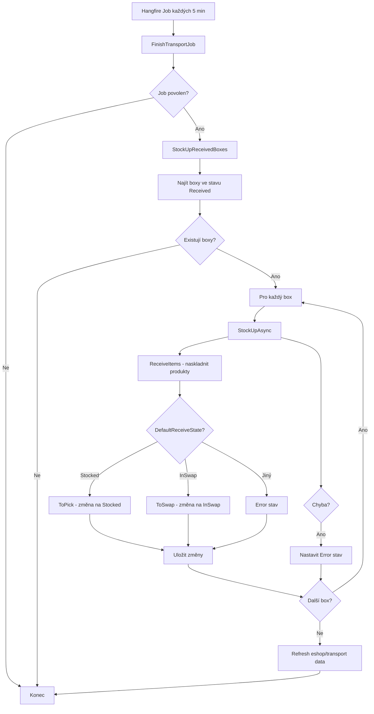

# Implementace periodického naskladňování transportních boxů

## Přehled systému

Systém automaticky každých 5 minut zpracovává transportní boxy ve stavu "Přijato" (`Received`) a převádí je do finálního stavu ("Naskladněno" nebo "Ve výměně") včetně aktualizace skladových zásob v e-shopu.

## Architektura komponent

### 1. Doménový model

#### 1.1 Stavy transportního boxu (enum)

```csharp
public enum TransportBoxState
{
    New = 0,           // Nový
    Opened = 1,        // Otevřený
    InTransit = 2,     // V přepravě
    Received = 3,      // Přijatý (zdrojový stav pro naskladnění)
    InSwap = 4,        // Ve výměně (cílový stav 1)
    Stocked = 5,       // Naskladněný (cílový stav 2)
    Closed = 6,        // Uzavřený
    Error = 7,         // Chybový stav
    Reserve = 8        // V rezervě
}
```

#### 1.2 Entita TransportBox

```csharp
public class TransportBox : AuditedAggregateRoot<int>
{
    // Základní properties
    public string Code { get; private set; }                    // Kód boxu
    public TransportBoxState State { get; private set; }        // Aktuální stav
    public TransportBoxState DefaultReceiveState { get; private set; } // Cílový stav po naskladnění
    public DateTime? LastStateChanged { get; set; }             // Čas poslední změny stavu
    public string Description { get; set; }                     // Popis/poznámky
    public string Location { get; set; }                        // Lokace
    
    // Kolekce
    public IReadOnlyList<TransportBoxItem> Items { get; }       // Items v boxu
    public IReadOnlyList<TransportBoxStateLog> StateLog { get; } // Log změn stavů
    
    // Metody pro změnu stavů
    public void Receive(DateTime date, string userName, TransportBoxState receiveState = TransportBoxState.Stocked);
    public void ToPick(DateTime date, string userName);         // Přechod do Stocked
    public void ToSwap(DateTime date, string userName);         // Přechod do InSwap
    public void Error(DateTime date, string userName, string message); // Přechod do Error
}
```

#### 1.3 Entita TransportBoxItem

```csharp
public class TransportBoxItem
{
    public int Id { get; set; }
    public string ProductCode { get; set; }     // Kód produktu
    public string ProductName { get; set; }     // Název produktu
    public double Amount { get; set; }           // Množství
    public DateTime CreatedAt { get; set; }
    public string CreatedBy { get; set; }
}
```

#### 1.4 Interface pro stock management

```csharp
public interface IEshopStockTakingDomainService
{
    Task StockUpAsync(StockUpRequest request);
}

public class StockUpRequest
{
    public string StockUpId { get; set; }    // ID dávky naskladnění
    public string Product { get; set; }      // Kód produktu
    public double Amount { get; set; }       // Množství k naskladnění
}
```

### 2. Application Layer

#### 2.1 Hangfire Job

```csharp
[DisableConcurrentExecution(timeoutInSeconds: 20 * 60)] // 20 minut timeout
public class FinishTransportJob : AsyncBackgroundJob<FinishTransportJobArgs>
{
    private readonly ITransportBoxAppService _appService;
    private readonly IJobsAppService _jobsService;

    public async Task FinishTransports(string jobName)
    {
        // Kontrola, zda je job povolen
        if (!await _jobsService.IsEnabled(jobName))
            return;

        await ExecuteAsync(new FinishTransportJobArgs());
    }

    public override Task ExecuteAsync(FinishTransportJobArgs args)
    {
        return _appService.StockUpReceivedBoxes(args.BatchId);
    }
}

public class FinishTransportJobArgs
{
    public string BatchId { get; set; } = "TransportJob";
}
```

#### 2.2 Transport Box Application Service

```csharp
public class TransportBoxAppService : ITransportBoxAppService
{
    private readonly IRepository<TransportBox, int> _repository;
    private readonly IClock _clock;
    private readonly ICurrentUser _userProvider;
    private readonly IEshopStockTakingDomainService _stockUpDomainService;
    private readonly ICatalogRepository _catalogRepository;

    [RemoteService(IsEnabled = false)]
    [AllowAnonymous]
    public async Task StockUpReceivedBoxes(string finishBatchId = null)
    {
        // 1. Najít všechny boxy ve stavu Received
        var boxes = await _repository.GetListAsync(f => f.State == TransportBoxState.Received);

        // 2. Vygenerovat batch ID, pokud není poskytnut
        if (finishBatchId == null)
            finishBatchId = _clock.Now.ToString("yyyy-MM-dd HH:mm:ss");

        // 3. Zpracovat každý box
        foreach (var box in boxes)
        {
            try
            {
                await StockUpAsync(new StockUpRequestDto()
                {
                    Id = finishBatchId,
                    BoxId = box.Id,
                    ReceiveState = box.DefaultReceiveState
                });
            }
            catch (Exception ex)
            {
                // Při chybě nastavit box do error stavu
                box.Error(_clock.Now, _userProvider.UserName, ex.Message);
                await _repository.UpdateAsync(box, true);
            }
        }

        // 4. Asynchronní refresh dat (neblokující)
        _ = Task.Run(async () =>
        {
            await _catalogRepository.RefreshEshopStockData(CancellationToken.None);
            await _catalogRepository.RefreshTransportData(CancellationToken.None);
        });
    }

    public async Task StockUpAsync(StockUpRequestDto request)
    {
        if (request.BoxId.HasValue)
        {
            var box = await _repository.GetAsync(request.BoxId.Value);
            
            // Naskladnit všechny items z boxu
            await ReceiveItems(request.Id, box.Items);
            
            // Změnit stav boxu podle DefaultReceiveState
            if (request.ReceiveState == TransportBoxState.InSwap)
                box.ToSwap(_clock.Now, _userProvider.UserName);
            else if (request.ReceiveState == TransportBoxState.Stocked)
                box.ToPick(_clock.Now, _userProvider.UserName);
            else
                box.Error(_clock.Now, _userProvider.UserName, $"Unknown receive state {request.ReceiveState}");
            
            await _repository.UpdateAsync(box, true);
        }
        else if (request.Items != null)
        {
            await ReceiveItems(request.Id, request.Items);
        }
        else
        {
            throw new AbpValidationException("Either BoxId or Items must have a value");
        }
    }

    private async Task ReceiveItems(string receiveId, IReadOnlyList<TransportBoxItem> items)
    {
        // Konverze na StockUpItem a volání stock service
        foreach (var item in items)
        {
            await _stockUpDomainService.StockUpAsync(new StockUpRequest()
            {
                StockUpId = receiveId,
                Product = item.ProductCode,
                Amount = item.Amount
            });
        }

        // Refresh dat v backgroundu
        _ = Task.Run(async () =>
        {
            await _catalogRepository.RefreshEshopStockData(CancellationToken.None);
            await _catalogRepository.RefreshTransportData(CancellationToken.None);
        });
    }
}
```

#### 2.3 DTO objekty

```csharp
public class StockUpRequestDto
{
    public string Id { get; set; }                          // Batch ID
    public int? BoxId { get; set; }                         // ID boxu k naskladnění
    public List<StockUpItem> Items { get; set; }            // Nebo přímo items
    public TransportBoxState ReceiveState { get; set; }     // Cílový stav
}

public class StockUpItem
{
    public string ProductCode { get; set; }
    public double Amount { get; set; }
}
```

### 3. Konfigurace Hangfire Job

#### 3.1 Registrace v aplikaci

```csharp
// V hlavním module (např. HttpApiHostModule)
public override void OnApplicationInitialization(ApplicationInitializationContext context)
{
    // ... ostatní konfigurace
    
    ConfigureHangfireJobs(app, context);
}

private void ConfigureHangfireJobs(IApplicationBuilder app, ApplicationInitializationContext context)
{
    var skipHangfireJobs = context.ServiceProvider
        .GetRequiredService<IConfiguration>()
        .GetSection("SkipHangfireJobsDeployment").Get<bool>();

    if (!skipHangfireJobs)
    {
        var finishTransport = app.ApplicationServices.GetRequiredService<FinishTransportJob>();
        
        // Registrace recurring job - spouští se každých 5 minut
        RecurringJob.AddOrUpdate(
            "Finish_Transport", 
            () => finishTransport.FinishTransports("Finish_Transport_Job"), 
            "*/5 * * * *"  // CRON výraz pro každých 5 minut
        );
    }
}
```

#### 3.2 Hangfire konfigurace

```csharp
private void ConfigureHangfire(ServiceConfigurationContext context, IConfiguration configuration)
{
    context.Services.AddHangfire(config =>
    {
        // Databázové storage (PostgreSQL v tomto případě)
        config.UsePostgreSqlStorage(configuration.GetConnectionString("Default"), 
            new PostgreSqlStorageOptions
            {
                QueuePollInterval = TimeSpan.FromSeconds(15),
                JobExpirationCheckInterval = TimeSpan.FromHours(1),
                CountersAggregateInterval = TimeSpan.FromMinutes(5),
                PrepareSchemaIfNecessary = true,
                SchemaName = "hangfire"
            });
    });
    
    // Hangfire server konfigurace
    context.Services.AddHangfireServer(options =>
    {
        options.WorkerCount = 1;  // Počet workerů
        options.Queues = new[] { "default" };
        options.ServerTimeout = TimeSpan.FromMinutes(5);
    });
}
```

### 4. Správa povolených jobů

#### 4.1 Job Management Service

```csharp
public class RecurringJobsAppService : IJobsAppService
{
    private readonly IRepository<RecurringJob, string> _repository;

    [RemoteService(IsEnabled = false)]
    [AllowAnonymous]
    public async Task<bool> IsEnabled(string jobId)
    {
        var job = await _repository.FindAsync(jobId);
        return job?.Enabled ?? true;  // Default je enabled
    }
}

// Entita pro správu job povolení
public class RecurringJob : Entity<string>
{
    public bool Enabled { get; set; } = true;
}
```

## Implementační kroky

### Krok 1: Nastavení doménového modelu
1. Vytvořit enum `TransportBoxState` s potřebnými stavy
2. Implementovat entitu `TransportBox` s metodami pro změnu stavů
3. Vytvořit `TransportBoxItem` pro items v boxu
4. Definovat interface `IEshopStockTakingDomainService` pro stock management

### Krok 2: Implementace Application Services
1. Vytvořit `FinishTransportJob` jako Hangfire background job
2. Implementovat `TransportBoxAppService` s metodou `StockUpReceivedBoxes`
3. Vytvořit potřebné DTO objekty

### Krok 3: Konfigurace Hangfire
1. Nainstalovat Hangfire packages
2. Nakonfigurovat databázové storage
3. Registrovat Hangfire server
4. Zaregistrovat recurring job s CRON výrazem

### Krok 4: Implementace stock integration
1. Implementovat `IEshopStockTakingDomainService` pro konkrétní e-shop systém
2. Zajistit refresh dat po naskladnění
3. Implementovat error handling a logging

### Krok 5: Monitoring a správa
1. Nastavit Hangfire Dashboard pro monitoring
2. Implementovat správu povolených jobů
3. Přidat logy pro sledování procesu
4. Nastavit alerting pro chyby

## Proces flow



## Důležité aspekty implementace

### Performance
- Job má timeout 20 minut
- Používá se `DisableConcurrentExecution` pro zabránění paralelnímu spuštění
- Refresh dat probíhá asynchronně v pozadí

### Error Handling
- Při chybě se box přepne do stavu `Error`
- Chybová zpráva se uloží do Description
- Job pokračuje s dalšími boxy i při chybě

### Bezpečnost
- Job metoda je označena `[AllowAnonymous]` a `[RemoteService(IsEnabled = false)]`
- Kontrola povolení jobu přes `IsEnabled` před spuštěním

### Monitoring
- Hangfire Dashboard pro sledování běhu jobů
- State log pro audit změn stavů boxů
- Batch ID pro seskupování operací

## Závěr

Tento dokument poskytuje kompletní návod pro implementaci obdobného systému v jiné aplikaci s možností přizpůsobení konkrétním požadavkům. Klíčové je správné nastavení stavového modelu, implementace robustního error handlingu a zajištění monitoringu procesu.